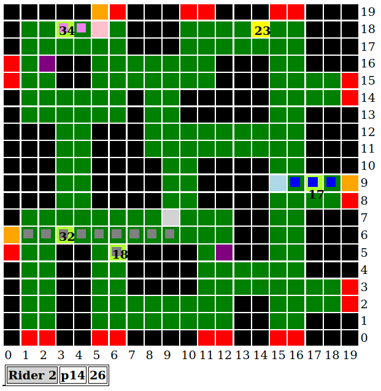

# GlovoJS

[Deliveroo.js](https://github.com/unitn-ASA/Deliveroo.js) is an educational game developed for the course of Automonous Software Agents at the University of Trento. The game is a simplified version of Deliveroo's delivery system where agents must pick up parcels and deliver them to the correct delivery zones. The game is played on a grid where agents can move in the four cardinal directions and pick up and carry multiple parcels.

**GlovoJS** is a system that allows to run simultaneously multiple agents with an optimized algorithm that creates the best delivery strategy to maximize the number of delivered parcels, even in the presence of antagonistic agents.

## Project Structure

```
GlovoJS
├── data
│   ├── action.js
│   ├── field.js
│   ├── geneticBrain.js
│   ├── position.js
│   ├── rider.js
│   ├── server.js
│   ├── tile.js
│   └── utils.js
├── images
├── agent.js
├── dashboard.css
├── index.js
├── multi_dashboard.html
├── package.json
└── README.md
```

## Implementation

The system is implemented in JavaScript via Node.js, each component is implemented as a class and the main loop is implemented in agent.js, which is the entry point of the system. The main components are:

- **Agent** - this class contains all the sensing function that interact with the server and the game state, it also contains the main loop that is used to run the agents and consume the actions generated by the planner.

- **Rider** - this class represent the agent that moves on the grid and picks up and delivers parcels, each rider contains all the information about its game state.

- **Genetic** - this class is used to implement the genetic algorithm that is used to optimize the delivery strategy of the agents. All the riders are dependent on this class as it is used to generate the best cooperative plan for each and every rider.

- **Field** - this class represents the game field, it contains all the information about the parcels, delivery zones and spawn zones which is used to generate the graph that is used by the genetic algorithm.

- **Dashboard** - the dashboard offers a real time visualization of the game state and the agents' actions. Thanks so this tool it's possible to visualize not only the agent's actual percept but also the plans that the agents are following, great for debug.

Some additional components are present to have handy representations of actions, positions and other data structures.

## Usage

To run the system you need to have Node.js installed on your machine as well as all the dependencies for the project. To install the dependencies you can run:

```bash
npm install
```

After that you can run the system with:

```bash
npm start
```

You can provide some parameters to change the configuration of the system, the parameters are in order:

- **agents** - the number of agents that will be spawned in the game _(default 1)_
- **pop** - the population of the genetic algorithm _(default 100)_
- **gen** - the number of generations that the genetic algorithm will run _(default 30)_
- **port** - the port of the dashboard _(default 8080)_

For example to run the system with 2 agents, a population of 50 and 20 generations you can run:

```bash
npm start 2 50 20
```

In case you want to run multiple separate instances of GolovoJS on the same machine you may need to change the port in order to access the different dashboards. By the default the address of the dashboard is `http://localhost:3000`.



Each agent and their respective plans are represented by a different color (3 in this case: pink, blue, gray), enemy agents are represented by a purple tiles.

Numbered tiles represent free parcels, the number is the current score of the parcel, when the parcel tile is highlighted in light green it means that an agent is going to pick it up, if that's not the case the tile is highlighted in yellow.

Delivery zones are represented by red tiles, if a delivery is planned the tile will be highlighted in orange.

Below the grid there is a synthetic summary of the parcels currently being carried by the agents, complete of current score and parcel id.

## Features

- **Genetic Algorithm** - the system uses a **genetic algorithm** to optimize the delivery strategy of the agents. The objective of the algorithm is to maximize the fitness of a plan, the fitness is computed weighting the parcels to be delivered and the distance traveled.

  One interesting feature is that to change the behavior of the agents it's sufficient to tune the parameters inside the fitness function, giving more importance to the distance traveled, the parcels delivered, the frequency of delivery and so on. It's also _trivially easy_ to add new parameters as the fitness function itself is a simple function that takes a plan and returns a number.

- **Real Time Dashboard** - the system offers a real time dashboard that allows to visualize the game state and the agents' plans. The dashboard is useful to debug the system and to understand the behavior of the agents.

- **Multiple Agents** - the system can run an **arbitrary number of agents** simultaneously, each agent is independent of the others and has its own plan and strategy computed by the genetic algorithm. The complexity of the system grows linearly with the number of agents as the genetic algorithm has a fixed population/generation size and the pathfinding is computed for each agent.

- **Optimized Pathfinding** - the system uses a Breadth First Search algorithm to compute the shortest path between two points on the grid. However, the BFS is optimized to avoid recomputing the path for the same points, this is done by **caching the results of the BFS** and reusing them when needed this means that the performance actually increases as teh game progresses and the agents move around the grid.

  The hit rate of the cache is very high as the agents tend to move between spawnable tiles and delivery zones, hit rates range from 50% to 95% depending on the map and the number of agents.

## NOTES

- high populations seem to work better in more open maps whereas low populations work better in more closed maps. Might be due to the higher chance of replanning in busier maps that penalize the high pupulation agent since planning is more costly and it impacts the speed of the agent. While the plans might be better the speed of the "dumber" agents allows them to steal parcels and deliver them faster.

## TODO

- [x] Define interfaces
- [x] Implement actions data structure
- [x] Implement actions actuation
- [x] Implement dashboard
- [x] Implement planner
- [x] Improve reasoning to pick up multiple parcels instead of delivering asap
- [x] Stop going after parcels that have already been delivered
- [x] Anytime the agent steps on a parcel, pick it up
- [x] Anytime the agent steps on a delivery zone, deliver
- [x] (kinda) Prevent moving to unreachable tiles
- [x] Contain all planning inside the brain
- [x] Make sure planner doesnt miss new or previously discovered parcels
- [x] Planner must consider other agent's positions
- [x] Planner must make sure agent can get unstuck
- [x] Make sure planner doesnt forget he's carrying parcels when replanning
- [x] Double check for closest delivery point

- [x] Make sure agent knows how much (and how many parcels) he can carry when replanning
- [x] Penalize overly long paths
- [x] make sure agent forgets parcels left in memory when the tile comes back in view and the parcel is gone

- [x] Make sure agent doesnt crash when NO plan is found (og no parcels, no delivery zones, no reachable tiles)

- [x] reimplement agent blocking logic

- [x] fix crossover for multiple agents
- [x] make sure player_parcels are handled correctly in the planner
- [x] make sure parcels are correctly memorized
- [x] fix bfs crashing when position is not round
- [x] penalize too many plan changes
- [x] check if carried parcels are correcly evaluated when replanning
- [x] rework parcels clock
- [x] figure out why agent crashes when 2-action long backup plan is created and after consuming action

- [x] make sure it's possible to generate a plan with delivery only in case one agent has parcels
- [x] fix the stuff about fitness in delivery only
- [x] rethink logic when it's time to replan (due to delivery or plan end)

- [x] fix dashboard now highlighting all the parcels to be picked up
- [x] fix plans swapping between agents (might be an indexing issue)
- [x] make sure a valid plan is created if one agent has no reachable parcels
- [x] make sure in geneticTSP when one rider has no nodes (so zero genes) it doesn't happen that a random plan is generated for ALL riders.
- [?] fix agent not seeing (?) parcel when in the same cell (might be due to delayed replanning OR too short bfs)

- [ ] fix order of parcels in plan generation
- [x] add caching system for bfs
- [ ] make sure cache doesn't get too big
- [ ] penalize riders that don't deliver for too long (exp in case of non-decaying parcels)
- [ ] add replanning when parcels are stolen
- [x] clean code
- [x] search&destroy legacy variables
- [x] reimplement parcel decay in fitness
- [x] is the dummy_parcel in builGraphInOut even needed? (might be a leftover from the old implementation)
- [x] make sure chances are computed correctly in rouletteWheel, in particular in case of negative fit (for the moment I set a lower bound for fitness as -Infinity screws with the probabilities and removed the rounding of the chances) THIS MUST BE VERIFIED
- [x] dynamically change STEP_COST and penalities based on the config
- [ ] exponential decay for metrics might not be that beneficial
- [x] reimplement parcels clock

## Authors

- [@lorenzoorsingher](https://github.com/lorenzoorsingher)
- [@Edomenegaz](https://github.com/Edomenegaz)
- [GitHub repo](https://github.com/lorenzoorsingher/ASA_Glovojs)
