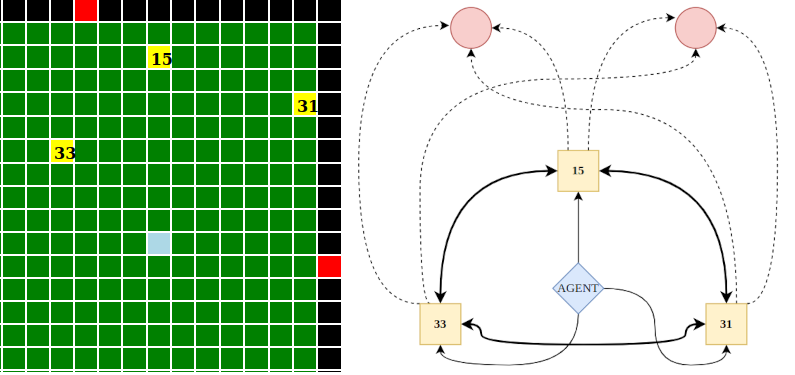
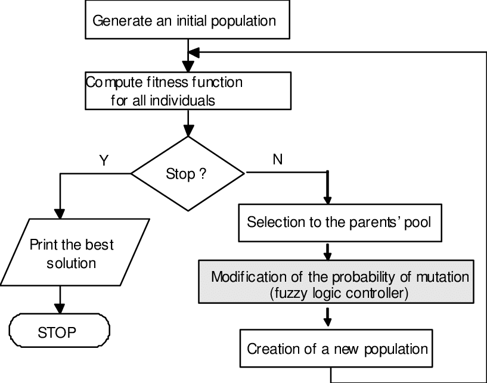
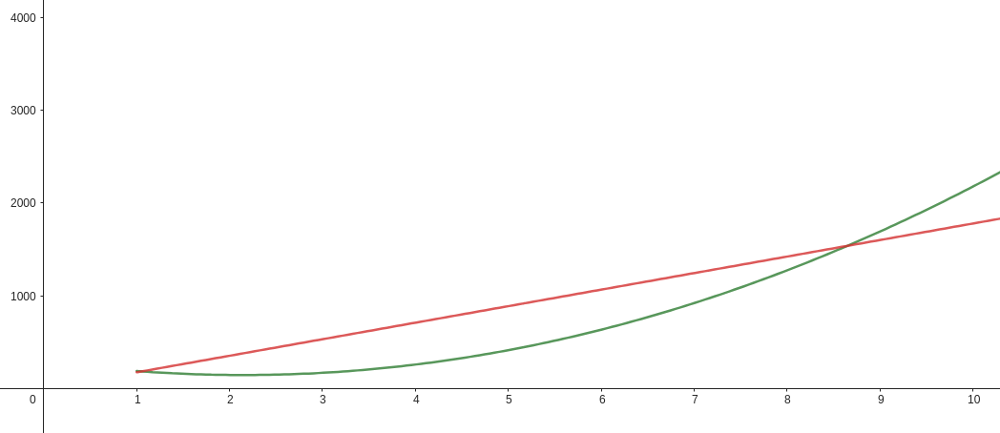

# GlovoJS: A BDI-based Solution for Autonomous Parcel Delivery

Edoardo Meneghini & Lorenzo Orsingher
University of Trento, a.y. 2023/2024

---

## Outline

1. System Architecture
2. Algorithms and Implementation
3. Performance Optimization
4. Evaluation and Results
5. Challenges and Solutions
6. Future Improvements
7. Conclusions

---

## System Architecture

- Modular design for scalability and updates
- Key components:
  - **Brain** → Coordination and fitness of agents
  - **Agent** → Agent creation, setup and main loop
  - **Rider** → Instance of every agent 
- Data structures
  - **Position**
  - **Tile**
  - **Field**

---

## BDI Architecture

- **Beliefs**: Agent's knowledge of the environment
  - Map Beliefs
  - Agents Beliefs
  - Parcels Beliefs
- **Desires**: Goals (maximize score)
- **Intentions**: Generated plans

.png)

---

## PDDL Integration
using `Planutils` and `@unitn-asa/pddl-client`
 

- Core component for pathfinding and planning
- Dynamic generation of PDDL domain and problem descriptions
- Parallel solving for multiple pathfinding problems

 

Note: Significant difference between local and online solver. 
Local solver could still be improved performance-wise. 
   

---

## Algorithms: Path Planning
- Breadth-First Search (BFS)
  - Optimal for unweighted graphs
  - Simple implementation
  - Memory efficient in this case
  - Adaptable to dynamic obstacles

   

Mainly used for pathfinding tasks during **Challenge #1** – 3ms time per BFS call on average 

---

## Algorithms: Decision Making

- Genetic Algorithm for plan optimization
- Key features:
  - Graph representation of environment
  - Multi-crossover operation
  - Adaptive planning
  - Scalability (multi agent)
  - Long-term optimization

---

## Genetic Algorithm: Key Steps

1. Initialize population
2. Evaluate fitness
3. Select parents
4. Perform crossover and mutation
5. Create new generation
6. Repeat until termination condition

---

## Multi-Agent Coordination

- Centralized approach using external "Brain"
- Global state consideration for optimal planning
- Efficient use of PDDL solver
- Linear complexity increase with number of agents
- Constraint: No two plans can contain the same parcel

---

## Performance Optimization: Parallelization
Premise: PDDL calls are costly, mainly due to the `Fetch API` calls that can't be avoided
 

- Bundling multiple pathfinding requests together > Single calls
- Challenges:
  - One unreachable goal invalidates entire problem
  - Exponential complexity growth with goals
- Solution: Chunking large problems

---

## Performance Optimization: Parallelization
Grouping multiple path finding tasks
          

---
## Performance Optimization: Caching

- Storing precomputed paths
- Cache key: concatenation of locations and blocked tiles
- Bidirectional path storage
- Significant performance improvement, especially with PDDL
- "Boost" mode for precomputing paths

---

## Evaluation and Results

- Performance metrics:
  - Dashboard for real-time visualization
  - Analytics for resource usage
  - Enhanced logs for debugging

- Benchmarking scenarios:
  - Single-agent
  - Multi-agent

---

# Benchmarking Results

## Single-agent and Multi-agent tests
---

## Single-agent scenario:
  - BFS agent outperformed PDDL agents
  - BOOSTPDDL showed improvements over ALLPDDL

 

| scenario      | time | ALLPDDL | BOOSTPDDL | ALLBFS |
|---------------|------|---------|-----------|--------|
| challenge_21  | 5    | 341     | 566       | 681    |
| challenge_21  | 10   | 351     | 518       | 680    |
| challenge_22  | 5    | 378     | 466       | 657    |
| challenge_22  | 10   | 401     | 523       | 670    |
| challenge_23  | 5    | 272     | 410       | 513    |
| challenge_23  | 10   | 377     | 394       | 530    |

 

*The tables show the average **points per minute (PPM)** achieved by each agent in the different scenarios. The results are averaged over multiple runs to ensure consistency and reliability.*

---

## Multi-agent scenario:
  - BFS agent still performed best
  - PDDL agents struggled in larger, sparser maps

| scenario | time | ALLPDDL | BOOSTPDDL | ALLBFS |
|----------|------|---------|-----------|--------|
| 24c1_3   | 5    | 246     | 208       | 545    |
| 24c1_3   | 10   | 246     | 209       | 544    |
| 24c1_5   | 5    | 258     | 419       | 721    |
| 24c1_5   | 10   | 287     | 413       | 737    |

 

*The tables show the average **points per minute (PPM)** achieved by each agent in the different scenarios. The results are averaged over multiple runs to ensure consistency and reliability.*

---

## Multi-agent in single-agent scenario

 

| scenario     | time | ALLBFS |
|--------------|------|--------|
| challenge_21 | 5    | 1248   |
| challenge_21 | 10   | 1251   |
| challenge_22 | 5    | 1220   |
| challenge_22 | 10   | 1226   |
| challenge_23 | 5    | 1063   |
| challenge_23 | 10   | 1088   |

 

*For comparison, a fleet of two collaborative agents playing the single-agent scenarios.*

---

## Benchmark Summary

---

## Challenges and Solutions

1. Local Planner Overhead
   - Solution: Bundling multiple planning queries

2. PDDL Goal Specification Limitations
   - Solution: Fallback mechanism for unachievable goals

3. Large Response Payload Processing
   - Partial offset of gains from reduced call frequency

4. Performance Limitations of Local Solver
   - Remained a bottleneck for real-time decision-making

---

## Future Improvements

1. Solver efficiency
   - Reduce overhead in PDDL solver calls

2. Robust e2e communication protocols
   - Implement end-to-end encryption for agent communication

3. Game-specific strategies
   - Develop advanced tactics for multi-agent coordination

---

## Conclusions

- Successful combination of genetic algorithms, BDI architecture, and PDDL
- Effective multi-agent coordination and path planning
- Areas for improvement:
  - Computational efficiency in dynamic environments
  - Advanced planning strategies
  - Integration of PDDL-based problem solving

---

# Thank you for your attention.

### We are available to answer questions.

    

Edoardo Meneghini & Lorenzo Orsingher
University of Trento, a.y. 2023/2024